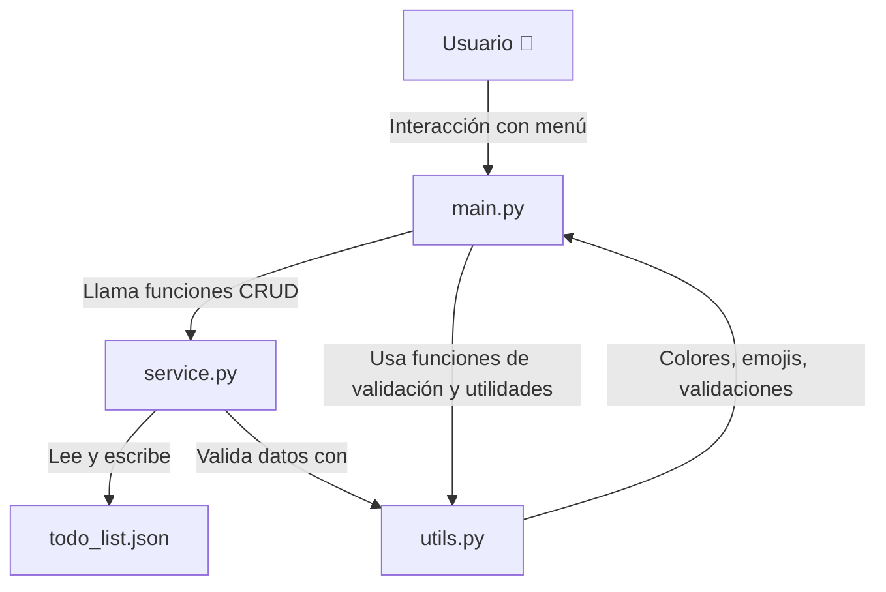

# Documentación del Prompt - TODO List en Python (Junior)

## 1. Resumen Ejecutivo

El objetivo de este documento es dejar registrado el proceso para crear un **prompt** que genere una aplicación de **TODO List** en **Python**, pensada como si fuera desarrollada por un **programador junior**.  
El resultado final es un prompt optimizado para **Windsurf AI**, que permite crear una app simple por consola, con **CRUD completo** sobre tareas, prioridad y estado, guardando datos en **JSON** y con una estructura básica y fácil de mantener.

---

## 2. Registro de Pedidos y Respuestas

### Pedido del usuario
> "Necesito generar una aplicación para guardar una lista de tareas que se ejecute por consola.  
> Dicha TODO List debo realizarla en Python.  
> Debería guardar Tarea, prioridad y estado (pendiente/hecho).  
> El programa debe ofrecer todas las funciones de un CRUD, en un bucle infinito hasta que seleccione la opción de salir.  
> Luego de cada operación, deberá guardar o actualizar los datos en un archivo CSV.  
> Otra opción del programa es generar un archivo JSON con toda la información a modo de exportar los datos.  
> Quiero que me hagas todas preguntas necesarias para armar un prompt adecuado para que otra IA me pueda generar el código necesario."

**Respuesta de GPT:**  
Te pedí detalles sobre:
- Si preferías usar **clases o funciones simples**.
- Cómo manejar el almacenamiento (**CSV vs JSON**).
- Si querías **exportar** o **persistir** los datos automáticamente.
- Validaciones, colores, emojis, comentarios y arquitectura.

---

### Pedido del usuario
> "Agrego detalles para mejorar la experiencia de usuario.  
> Cuando se edite una tarea, se debe mostrar los datos actuales y preguntar qué campo se quiere modificar: Tarea, prioridad o estado, y sin limpiar la pantalla debe pedirse el nuevo valor del campo elegido.  
> Luego de modificarlo, preguntar si se quiere editar otro campo más, sino volver al menú.  
> Cambio el uso de los archivos. Quiero que se guarde siempre en un archivo JSON y en caso de querer exportarlo que se haga en un CSV.  
> El nombre de este archivo será la fecha de generación ej: `yyyyMMdd_hhmmss_-_todo_list.csv`.  
> El JSON no quiero que esté indexado por el id. Mejor que esté el id como un atributo más del objeto y el JSON sea un array de objetos.  
> ¿Se entendió lo que agregué?"

**Respuesta de GPT:**  
Sí, confirmé la comprensión y ajustamos el diseño:
- Persistir siempre en **JSON**.
- Exportar solo a **CSV** con nombre dinámico.
- El JSON será un **array de objetos**, no un mapa indexado.
- La edición de tareas será **interactiva y flexible**.

---

### Pedido del usuario
> "Quiero que me generes un prompt para Windsurf con la misma aplicación, pero como si la desarrollara un junior.  
> Quiero menos complejidad en el código.  
> Mi idea era un archivo main, tal vez un service con las funciones de CRUD. Algo más simple."

**Respuesta de GPT:**  
Te propuse un enfoque modular más básico:
- **main.py** → Lógica de menús e interacción.
- **services.py** → Funciones CRUD.
- **utils.py** → Validaciones y utilidades.

---

### Pedido del usuario
> "Quiero un nuevo prompt, como si lo escribiera un junior.  
> Algo así como un archivo main donde esté la lógica de los menús, un archivo para las validaciones y utilidades, y otro archivo donde esté la lógica de negocio, con las funciones que hará cada opción del menú.  
> ¿Qué te parece?"

**Respuesta de GPT:**  
Confirmé que es válido y te hice preguntas sobre:
- Uso de **clases**.
- Manejo del listado de tareas.
- Validaciones.
- Exportación de CSV (que luego eliminamos).

---

### Pedido del usuario
> "Eliminemos la opción de exportar CSV. Así queda más simple y con menos código."

**Respuesta de GPT:**  
Quedamos en:
- Solo **persistencia en JSON**.
- Eliminamos por completo la exportación a CSV.

---

### Pedido del usuario
> "Me gustaría mantener los emojis y colores de texto.  
> También quiero que las funciones estén comentadas."

**Respuesta de GPT:**  
Se decidió:
- Agregar **emojis** en menús y mensajes.
- Colorear textos para mejorar UX.
- Comentar todas las funciones.

---  
---  
---  

# 📝 Prompt Junior para Windsurf — Aplicación TODO List en Python

Este documento describe **la arquitectura** y el **prompt completo** para que una IA (como Windsurf)
genere una aplicación TODO List simple en Python, pensada como si la hubiera desarrollado
un programador **junior**, pero con buenas prácticas.

---

## **Diagrama de arquitectura — TODO List (versión junior)**



---

## **Responsabilidades de cada archivo**

### **1. `main.py`** 🧩 *(Controlador principal)*
- Maneja **el menú de opciones**.
- Interactúa con el usuario.
- Llama a las funciones de **`service.py`** para realizar operaciones CRUD.
- Usa utilidades de **`utils.py`** para validaciones, colores y formateos.
- Controla el flujo general de la aplicación.

---

### **2. `service.py`** 🛠 *(Lógica de negocio)*
- Contiene la clase **`TodoService`** con funciones CRUD:
  - `agregar_tarea()`
  - `listar_tareas()`
  - `editar_tarea()`
  - `eliminar_tarea()`
  - `buscar_tareas()`
- Gestiona la lectura y escritura de **`todo_list.json`**.
- Se asegura de mantener la **consistencia de los datos**.
- Llama a **`utils.py`** para validaciones y formateo.

---

### **3. `utils.py`** 🧰 *(Utilidades y helpers)*
- Funciones para:
  - **Validaciones**: nombres únicos, opciones correctas, etc.
  - **Colores** y **emojis** para mejorar la experiencia.
  - **Formateo de tablas** para mostrar las tareas ordenadas.
  - **Limpieza de pantalla**.
- No maneja datos, solo **ayuda** a los otros módulos.

---

### **4. `todo_list.json`** 📄 *(Persistencia de datos)*
- Contiene todas las tareas.
- Estructura simple: **array de objetos JSON**.
- Cada tarea incluye:
  ```json
  {
    "id": 1,
    "nombre": "Comprar vino 🍷",
    "prioridad": "ALTA",
    "estado": "PENDIENTE",
    "fecha": "2025-09-01 18:30:00"
  }
  ```

---

## **Prompt Junior para Windsurf**

> Quiero que generes una **aplicación TODO List** en **Python 3.10+** que se ejecute por consola.
> La aplicación debe ser simple, como si la desarrollara un programador **junior**, pero con **código ordenado**, 
> funciones bien separadas y comentadas.

### **Requerimientos funcionales**

- Debe permitir **CRUD completo** sobre tareas:
  - **Crear** tareas con: nombre, prioridad, estado y fecha de última modificación.
  - **Listar** todas las tareas ordenadas alfabéticamente. Mostrar formato tipo tabla.
  - **Editar** una tarea mostrando los datos actuales y permitiendo cambiar **nombre, prioridad o estado**.
  - **Eliminar** una tarea por ID.
  - **Buscar** tareas por nombre parcial y filtrar por prioridad.
- Los estados posibles son:
  1. **PENDIENTE**
  2. **EN CURSO**
  3. **FINALIZADA**
- Las prioridades posibles son:
  1. **ALTA**
  2. **MEDIA**
  3. **BAJA**
- Si una tarea está **FINALIZADA**, no se puede modificar, pero **se puede crear una nueva con el mismo nombre**.
- Validar que **no existan tareas con nombres duplicados** salvo que la existente esté finalizada.
- Al editar, mostrar el dato actual y preguntar cuál campo se quiere cambiar.
- Mostrar **colores y emojis** para mejorar la experiencia de usuario.
- Listar máximo **15 tareas por pantalla** y hacer una pausa antes de mostrar las siguientes.

### **Requerimientos técnicos**

- Usar **3 archivos Python**:
  1. `main.py`: manejo de menús e interacción con el usuario.
  2. `service.py`: lógica de negocio (CRUD, persistencia JSON).
  3. `utils.py`: validaciones, colores, emojis y utilidades.
- Las tareas se guardan en un archivo **`todo_list.json`** como **array de objetos JSON**.
- Cada tarea tiene:
  - `id`: int
  - `nombre`: str
  - `prioridad`: str
  - `estado`: str
  - `fecha`: str (última modificación)
- **Actualizar el JSON por línea**: si se agrega, añadir solo la línea nueva; si se edita, reemplazar la existente.
- El código debe estar **comentado solo en funciones importantes**, evitando comentarios innecesarios.
- Usar **buenas prácticas básicas**, pero mantener la simplicidad.

---

## **Recomendación de uso**

1. Pegá todo este contenido en Windsurf.
2. Pedile que genere el código en **3 archivos separados** (`main.py`, `service.py`, `utils.py`).
3. Ejecutá el código con:
   ```bash
   python main.py
   ```

---

**Autor:** Prompt generado con ayuda de ChatGPT 🤖  
**Versión:** 1.0  
